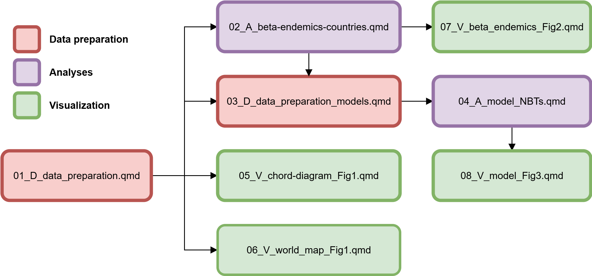

::: callout-note

<!-- This document has been anonymized for the review process. -->

This manuscript is submitted as a preprint [here](https://ecoevorxiv.org/repository/view/7539/)

Code and data can be downloaded from zenodo [](https://doi.org/10.5281/zenodo.13307474)
:::

# General overview

This repository contains the data and code used in the analysis of the manuscript entitled **"The hidden biodiversity knowledge split in biological collections"**.

In this study we characterized different aspects of spatial and temporal patterns of fish Name Bearing Types (NBT) among countries and world regions. The characteristics comprises the number of total NBT, the NBT flowing among different world regions, the characteristics of regions and countries regarding the source of NBT in their biological collection, the level of underepresentation of native species and the level of overepresentation of non-native species for each country.

We discuss how the fundamental knowledge in fish species is distributed and its implications for science development and knowledge sharing.

# Repository structure

## data

This folder stores raw and processed data used to perform all the analysis presented in this study

### raw

-   `flow_period_region_country.csv` a data frame in the long format containing the flowing of NBT per regions per per time (50-year time frame). Variables:

    -   `period` numeric variable representing 50-year time intervals

    -   `region_type` character representing the name of the World Bank region of the country where the NBT was sourced

    -   `country_type` character. A three letter code (alpha-3 ISO3166) representing the country of the museum where the NBT was sourced

    -   `region_museum` character. Name of the World Bank region of the country where the NBT is housed

    -   `country_museum` character. A three letter code (alpha-3 ISO3166) representing the country of the museum where the NBT is housed

    -   `n` numeric. The number of NBT flowing from one country to another

-   `spp_native_distribution.csv` data frame in the long format containing the native composition at the country level. Variables:

    -   `species` character. The name of a species in the format genus_epithet according to the Catalog of Fishes (including synonym names)

    -   `country_distribution` character. Three letter code (alpha-3 ISO3166) indicating the name of the country where a species is native to

    -   `region_distribution` character. The name of the region acording with World Bank where a species is native to

-   `spp_type_distribution.csv` data frame in the long format containing the composition of NBT by country. Variables:

    -   `species` character. The name of a species in the format genus_epithet according to the Catalog of Fishes (including synonym names)

    -   `country_distribution` character. Three letter code (alpha-3 ISO3166) indicating the name of the country where a species is housed

    -   `region_distribution` character. The name of the region acording with World Bank where a species is housed

-   `bio-dem_data.csv` data frame with data downloaded from [Bio-Dem](https://bio-dem.surge.sh/#awards) containing information on biological and social information at the country level. Variables:

    -   `country` character. A three letter code (alpha-3 ISO3166) representing a country

    -   `records` numeric. Total number of species occurrence records from Global Biodiverity Facility (GBIF)

    -   `records_per_area` numeric. Records per area from gbif

    -   `yearsSinceIndependence` numeric. Years since independence for each country

    -   `e_migdppc` numeric. GDP per capta

-   `museum_data.csv` data frame with museums' acronyms and the world region of each. Variables:

    -   `code_museum` character. Three letter code of the museum

    -   `country_museum` character. A three letter code (alpha-3 ISO3166) representing a country

    -   `region_museum` character. The name of the region acording with World Bank

### processed

-   `flow_region.csv` a data frame containing flowing of NBT among world regions and the total number of NBT derived from the source region

    - `region_type` character. The region, according to World bank classification,
        where the type was collected
    
    - `region_museum` character. The region, according to World bank classification,
        where the type is housed
        
    - `n` numeric. The number of types that flowed from `region_type` to `region_museum`
    
    - `total_region_type` numeric. The total number of name bearers sampled in each region

-   `flow_period_region.csv` a data frame with the number of NBT between the world regions per 50-year time frame and the total number of NBT in each time frame for each world region

    - `period` numeric. The year in which the name bearer was discovered
    
    - `region_type` character. The region, according to World bank classification,
        where the type was collected
        
    - `region_museum` character. The region, according to World bank classification,
        where the type is housed
        
    - `n` numeric. The number of name bearers that flowed from `region_type` to `region_museum`
    
    - `total_region_type` numeric. The total number of name bearers sampled in each region in 
        each time period

-   `flow_period_region_prop.csv` a data frame with the number of NBT, the Domestic Contribution and Domestic Retention between the world regions in a 50-year time frame

    - `period` numeric. The year in which the name bearer was discovered
    
    - `region_type` character. The region, according to World bank classification,
        where the type was collected
        
    - `region_museum` character. The region, according to World bank classification,
        where the type is housed
        
    - `n` numeric. The number of name bearers that flowed from `region_type` to `region_museum`
    
    - `total_period_region_type` numeric. The number of name bearers samples in a region in a time 
        period
        
    - `total_period_region_museum` numeric. The number of name bearers housed in biological 
        collections in a region in a time period
        
    - `total_period` numeric. The total number of name bearers described in a period
    
    - `prop_DC` numeric. The proportion of name bearers in biological collection of a region 
        sampled within the region in a time period. This variable is not used in the final 
        version of the study.
        
    - `prop_DR` numeric. The proportion of all name bearers sampled that were retained in
        a region in a time period. This variable is not used in the final 
        version of the study. 

-   `flow_region_prop.csv` data with the total number of species flowing between world regions, Domestic Contribution and Domestic Retention

    - `region_type` character. The region, according to World bank classification,
        where the type was collected
        
    - `region_museum` character. The region, according to World bank classification,
        where the type is housed
        
    - `total_region_type` numeric. The total number of name bearers sampled in a 
        region
        
    - `total_region_museum` numeric. The total number of name bearers housed in 
        biological collections in a region
        
    - `prop_DC` numeric. The proportion of name bearers in biological collection of a region 
        sampled within the region. This variable is not used in the final 
        version of the study
        
    - `prop_DR` numeric. The proportion of all name bearers sampled that were retained in
        a region. This variable is not used in the final 
        version of the study

-   `flow_country.csv` data frame with flowing information of NBT among countries

    - `country_type` character. A three letter code (alpha-3 ISO3166) representing a country
        where the name bearer was sampled
    
    - `country_museum` character. A three letter code (alpha-3 ISO3166) representing a country
        where the name bearer was housed
        
    - `n` numeric. The number of name bearers that flowed from `country_type` 
        to `country_museum` 
        
    - `total_country_type` numeric. The number of name bearers sampled in a 
        country

-   `df_country_native.csv` data frame with the number of native species at the country level

    - `country_distribution` character. A three letter code (alpha-3 ISO3166) representing a country
    
    - `region_distribution` character. The name of a region according to World Bank
    
    - `native.richness` numeric. The number of native species in a country according 
         to Catalog of Fishes

-   `df_country_type.csv` data frame with the number of NBT at the country level

    - `country_museum` character. A three letter code (alpha-3 ISO3166) representing a country
    
    - `region_museum` character. The name of a region according to World Bank
    
    - `type_region` numeric. The number of name bearers in biological collections
        in countries
        

-   `df_endemic_beta.csv` data frame with values of endemic deficit and non-endemic representation at the country level using only species with restricted occurrences (only one occurrence per country) at the country level

    - `native.beta` numeric. The endemic deficit calculated as the number of 
        endemic species outside of the country of origin
        
    - `type.beta` numeric. The number of non-endemic name bearers

-   `df_all_beta.csv` data frame with values of endemic deficit and non-endemic representation at the country level. This is used in the analysis of Supplementary material, specifically to generate
    Figure S2.

    - `countries` character. A three letter code (alpha-3 ISO3166) representing a country

    - `native.beta` numeric. The endemic deficit calculated as the number of 
        endemic species outside of the country of origin
        
    - `type.beta` numeric. The number of non-endemic name bearers

## R

The letters `D`, `A` and `V` represents scripts for, respectively, data processing (D), data analysis (A) and results visualization (V). The script sequence to reproduce the workflow is indicated by the numbers at the beginning of the name of the script file.



-   [`01_D_data_preparation.qmd`](R/01_D_data_preparation.qmd) initial data preparation

-   [`02_A_beta-endemics-countries.qmd`](R/02_A_beta-endemics-countries.qmd) This script is used to calculate `non endemic name bearers` and `endemic deficit` that will be used in the script [`07_V_beta_endemics_Fig2.qmd`](R/07_V_beta_endemics_Fig2.qmd)

-   [`03_D_data_preparation_models.qmd`](R/03_D_data_preparation_models.qmd) script used to build data frames that will be used in statistical models ([`04_A_model_NBTs.qmd`](R/04_A_model_NBTs.qmd))

-   [`04_A_model_NBTs.qmd`](R/04_A_model_NBTs.qmd) statistical models for the total number of NBT, endemic deficit
    and non endemic name bearers

-   [`05_V_chord_diagram_Fig1.qmd`](R/05_V_chord_diagram_Fig1.qmd) code used to produce circular flow diagram. This is the Figure 1 of the study

-   [`06_V_world_map_Fig1.qmd`](R/06_V_world_map_Fig1.qmd) code used to produce the world map in the Figure 1 of the main text

-   [07_V_beta_endemics_Fig2.qmd](R/07_V_beta_endemics_Fig2.qmd) code used to build Figure 2 of the main text

-   [`08_V_model_Fig3.qmd`](R/08_V_model_Fig3.qmd) code used to build the Figure 3 of the main text. This is the representation of the results of the models present in the script [04_A_model_NBTs.qmd](R/04_A_model_NBTs.qmd)

-   [`09_Supplementary_analysis.qmd`](R/09_Supplementary_analysis.qmd) code to produce all the tables and figures presented in the Supplementary material of this study


### functions

-   [`function_beta_types_success_fail.R`](R/010_Functions.qmd) function used to calculate endemic 
    deficit and non endemic name bearers.

-   [`function_scale_back.R`](R/010_Functions.qmd) function used to transform back normalized variables

### Summary statistics

-   [`011_Summary_stats.qmd`](R/011_Summary_stats.qmd) code needed to reproduce 
    summary statistics reported in the *Results* section of the main text of the 
    study *"The hidden biodiversity knowledge split in biological collections"* 

## output

### Figures

In this folder you will find all figures used in the main text and supplementary material of this study

- `Fig1_flow_circle_plot.png` Figure with circular plots showing the flux of NBT among regions of the world in a 50-year time window

<!-- `Fig2_DC_DR.png` Scaterplot with World regions characterized by their Domestic Contribution and Domestic Retention values in a 50-year time frame -->

- `Fig2_turnover_metrics_endemics.png` Cartogram with 3 maps showing the level of 
    endemic deficit, non endemic name bearers and the combination of both metrics
    biscale map. This is the Figure 2 in the main text

`Fig3_models.png` Figure showing the predictions of the number of name bearers, endemic deficit
    and non endemic name bearers for different predictors. Corresponds to Figure 3
    This is derived from 
    the [statistical models scripts](R/04_A_model_NBTs.qmd)

#### Supp-material

This folder contains the figures in the Supplementary material

-   `FigS1_native_richness.png` World map with countries colored according to 
    the number of native species richness according to the Catalog of Fishes. 
    This corresponds to Figure S1 in Supplementary material

-   `FigS3_turnover_metrics.png` Cartogram with 3 maps showing the native
    deficit, the non native name bearers proportion and the 
    combination of both metrics in a combined map. This corresponds to Figure S2 
    in Supplementary material


## Packages

| Package       | Version                                                | Documentation                                                             |
|---------------|---------------|------------------------------------------|
| bbmle         | 1.0.25.1                                               | [bbmle](https://cran.r-project.org/web/packages/bbmle/bbmle.pdf)          |
| betapart      | 1.6                                                    | [betapart](https://cran.r-project.org/web/packages/betapart/betapart.pdf) |
| biscale       | 1.0.0                                                  | [biscale](https://chris-prener.github.io/biscale/)                        |
| circlize      | 0.4.15                                                 | [circlize](https://jokergoo.github.io/circlize_book/book/)                |
| countrycode   | 1.6.0                                                  | [countrycode](https://vincentarelbundock.github.io/countrycode/#/)        |
| cowplot       | 1.1.1                                                  | [cowplot](https://wilkelab.org/cowplot/)                                  |
| DHARMa        | 0.4.6                                                  | [DHARMa](https://florianhartig.github.io/DHARMa/)                         |
| dplyr         | 1.1.4                                                  | [dplyr](https://dplyr.tidyverse.org)                                      |
| ggarrow       | 0.0.0.9000                                             | [ggarrow](https://teunbrand.github.io/ggarrow/)                           |
| ggplot2       | 3.5.0                                                  | [ggplot2](https://ggplot2.tidyverse.org)                                  |
| glmmTMB       | 1.1.8                                                  | [glmmTMB](https://glmmtmb.github.io/glmmTMB/)                             |
| glue          | 1.6.2                                                  | [glue](https://glue.tidyverse.org)                                        |
| here          | 1.0.1                                                  | [here](https://here.r-lib.org)                                            |
| patchwork     | 1.2.0.9000                                             | [patchwork](https://patchwork.data-imaginist.com)                         |
| performance   | 0.12.1                                                 | [performance](https://easystats.github.io/performance/)                   |
| phyloregion   | 1.0.8                                                  | [phyloregion](https://phyloregion.com)                                    |
| readr         | 2.1.4                                                  | [readr](https://readr.tidyverse.org)                                      |
| rmapshaper    | 0.5.0                                                  | [rmapshaper](https://andyteucher.ca/rmapshaper/)                          |
| rnaturalearth | 0.3.4                                                  | [rnaturalearth](https://ropensci.github.io/rnaturalearth/)                |
| scales        |  1.4  | [scales](https://scales.r-lib.org)                                        |
| sf            | 1.0-14                                                 | [sf](https://r-spatial.github.io/sf/)                                     |
| tidyr         | 1.3.1                                                  | [tidyr](https://tidyr.tidyverse.org)                                      |


# Contact

[Gabriel Nakamura](https://github.com/GabrielNakamura) and [Bruno Mioto](https://github.com/brunomioto)

If you have any suggestion or commentary, please open an issue

[Source code](https://github.com/GabrielNakamura/NBT_code_data)

# Session Info

```{r}
sessionInfo()
# R version 4.3.1 (2023-06-16 ucrt)
# Platform: x86_64-w64-mingw32/x64 (64-bit)
# Running under: Windows 11 x64 (build 26100)
# 
# Matrix products: default
# 
# 
# locale:
# [1] LC_COLLATE=Portuguese_Brazil.utf8  LC_CTYPE=Portuguese_Brazil.utf8   
# [3] LC_MONETARY=Portuguese_Brazil.utf8 LC_NUMERIC=C                      
# [5] LC_TIME=Portuguese_Brazil.utf8    
# 
# time zone: America/Sao_Paulo
# tzcode source: internal
# 
# attached base packages:
# [1] stats4    stats     graphics  grDevices utils     datasets  methods   base     
# 
# other attached packages:
#  [1] biscale_1.0.0       cowplot_1.1.3       rmapshaper_0.5.0    sf_1.0-14          
#  [5] rnaturalearth_1.0.1 DHARMa_0.4.7        bbmle_1.0.25.1      performance_0.15.0 
#  [9] glmmTMB_1.1.11      countrycode_1.6.1   tidyr_1.3.0         patchwork_1.2.0    
# [13] ggplot2_3.5.0.9000  scales_1.4.0        dplyr_1.1.3         tibble_3.2.1       
# [17] ggeffects_2.3.0     here_1.0.1          readr_2.1.4        
# 
# loaded via a namespace (and not attached):
#   [1] RColorBrewer_1.1-3  rstudioapi_0.15.0   jsonlite_1.9.0      datawizard_1.1.0   
#   [5] magrittr_2.0.3      farver_2.1.1        nloptr_2.0.3        ragg_1.2.6         
#   [9] vctrs_0.6.4         minqa_1.2.6         terra_1.7-55        forcats_1.0.0      
#  [13] htmltools_0.5.7     itertools_0.1-3     clustMixType_0.4-2  haven_2.5.3        
#  [17] curl_5.1.0          betapart_1.6        KernSmooth_2.23-21  plyr_1.8.9         
#  [21] TMB_1.9.17          igraph_2.0.2        mime_0.12           lifecycle_1.0.4    
#  [25] minpack.lm_1.2-4    iterators_1.0.14    pkgconfig_2.0.3     sjlabelled_1.2.0   
#  [29] phyloregion_1.0.8   gap_1.6             Matrix_1.6-1.1      R6_2.5.1           
#  [33] fastmap_1.1.1       snakecase_0.11.1    rbibutils_2.3       shiny_1.8.0        
#  [37] magic_1.6-1         digest_0.6.33       numDeriv_2016.8-1.1 colorspace_2.1-0   
#  [41] rprojroot_2.0.4     textshaping_0.3.7   qgam_2.0.0          vegan_2.7-1        
#  [45] labeling_0.4.3      fansi_1.0.5         httr_1.4.7          abind_1.4-5        
#  [49] mgcv_1.9-3          compiler_4.3.1      proxy_0.4-27        bit64_4.0.5        
#  [53] withr_2.5.2         doParallel_1.0.17   DBI_1.1.3           MASS_7.3-60        
#  [57] classInt_0.4-10     permute_0.9-8       units_0.8-4         tools_4.3.1        
#  [61] ape_5.8-1           httpuv_1.6.13       glue_1.6.2          quadprog_1.5-8     
#  [65] rcdd_1.6            nlme_3.1-162        promises_1.2.1      grid_4.3.1         
#  [69] cluster_2.1.4       generics_0.1.3      snow_0.4-4          predicts_0.1-19    
#  [73] gtable_0.3.4        tzdb_0.4.0          class_7.3-22        hms_1.1.3          
#  [77] sp_2.1-3            utf8_1.2.4          foreach_1.5.2       pillar_1.9.0       
#  [81] vroom_1.6.4         later_1.3.1         splines_4.3.1       lattice_0.21-8     
#  [85] bit_4.0.5           tidyselect_1.2.0    knitr_1.45          reformulas_0.4.1   
#  [89] V8_6.0.4            xfun_0.41           smoothr_1.1.0       geojsonsf_2.0.3    
#  [93] boot_1.3-28.1       codetools_0.2-19    maptpx_1.9-7        cli_3.6.1          
#  [97] xtable_1.8-4        geometry_0.5.2      systemfonts_1.2.1   Rdpack_2.6.4       
# [101] Rcpp_1.0.11         doSNOW_1.0.20       bdsmatrix_1.3-7     parallel_4.3.1     
# [105] picante_1.8.2       ellipsis_0.3.2      gap.datasets_0.0.6  lme4_1.1-35.1      
# [109] phangorn_2.12.1     mvtnorm_1.2-3       slam_0.1-50         e1071_1.7-13       
# [113] insight_1.3.1       purrr_1.0.2         crayon_1.5.2        combinat_0.0-8     
# [117] rlang_1.1.2         fastmatch_1.1-6
```
